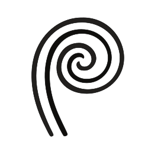

# Fernwright MCP (Rust + Browser Extension)

<p align="center">
  
</p>

Fernwright MCP is an open alternative to closed-source browser-to-MCP extensions.
It combines a local Rust MCP server with a browser extension that operates on your real tabs and sessions.

The name `Fernwright` reflects the fern-inspired logo while still feeling at home in the browser automation ecosystem.
For compatibility, the binary name and some internal identifiers currently remain `fernwright-mcp` and `fernwright-tab-bridge`.

## Installation

From crates.io:

```bash
cargo install fernwright-mcp
```

From source:

```bash
git clone https://github.com/cupnfish/fernwright-mcp.git
cd fernwright-mcp
cargo install --path .
```

## Components

Fernwright MCP has two parts:

1. A browser extension (Manifest V3) that runs in your real browser profile and automates existing tabs through `chrome.tabs` and `chrome.scripting`.
2. A Rust MCP server that:
   - exposes a Streamable HTTP MCP endpoint at `/mcp`
   - forwards tool calls to the extension over a local WebSocket bridge
   - provides a tray icon with quick-copy actions for endpoints and client config snippets

## Why this architecture

This split is practical for real-session browser automation:

- Browser control and authenticated session reuse must happen inside the extension context.
- MCP clients connect to a local HTTP MCP endpoint.
- Rust owns the MCP server and local orchestration logic.
- WebSocket is a clean local-only bridge between the server and the extension runtime.

## Logo

The project logo is stored in `assets/icon.svg` and is rendered directly above in this README.

## Project layout

```text
.
├── assets/
│   └── icon.svg              # Fernwright MCP logo
├── extension/
│   ├── manifest.json         # MV3 extension manifest
│   ├── service_worker.js     # WebSocket bridge + tab/action handlers
│   ├── popup.html            # Toolbar popup UI
│   ├── popup.js              # Live connection status UI logic
│   ├── options.html          # Extension options UI
│   └── options.js            # Server URL + reconnect/status controls
├── src/
│   ├── main.rs               # CLI + process startup + tray integration
│   ├── bridge.rs             # Extension client registry + request/response bridge
│   ├── mcp_server.rs         # rmcp SDK-based MCP tool server logic
│   ├── mcp_http.rs           # rmcp streamable-http server (/mcp)
│   ├── search.rs             # Retrieval/filter tool args + result models
│   ├── search_service.rs     # Rust-side retrieval/enrichment implementation
│   └── config_export.rs      # Client config export helpers
└── Cargo.toml
```

## Supported tools

The Rust MCP server currently exposes these tools:

- `list_clients`
- `list_tabs`
- `navigate_tab`
- `activate_tab`
- `click`
- `fill`
- `press_key`
- `evaluate_js`
- `extract_text`
- `wait_for`
- `capture_screenshot`
- `extract_page_context`
- `get_page_html`
- `search_tabs`
- `search_page_content`
- `filter_tabs`
- `extract_structured_data`
- `find_in_page`

These tools operate on tabs from your signed-in browser profile through the extension.

## Retrieval-enhanced tools

The following tools add retrieval, filtering, and HTML structure extraction without changing extension code.
The Rust side reuses existing bridge methods such as `listTabs` and `getPageHtml`, then performs matching and parsing locally.

- `search_tabs`
  - Searches cached tab metadata such as `title` and `url` with plain text or regex.
  - Supports `fields`, `use_regex`, `case_sensitive`, and `max_results`.
  - Returns relevance-sorted matches with context snippets.
- `search_page_content`
  - Searches a specific tab by `tab_id`.
  - `scope="cached"` searches cached tab metadata only.
  - `scope="full"` fetches HTML via `get_page_html` and searches extracted content.
  - Supports `selector`, `context_chars`, and `max_matches`.
- `filter_tabs`
  - Filters tabs by `url_pattern`, `title_pattern`, `domain`, `active_only`, `pinned_only`, and `incognito_only`.
  - Supports regex and case-sensitive matching.
- `extract_structured_data`
  - Extracts `tables`, `lists`, `headings`, or `all` from tab HTML.
  - Supports `selector`, `max_items`, and metadata output.
- `find_in_page`
  - Runs `search_tabs` first.
  - Optionally performs `search_page_content(scope=full)` on matched tabs when `deep_search=true`.
  - Returns per-tab warnings for deep-search failures without failing the entire request.

### Retrieval call examples

```json
{
  "method": "tools/call",
  "params": {
    "name": "search_tabs",
    "arguments": {
      "query": "production|staging",
      "fields": ["title", "url"],
      "use_regex": true,
      "max_results": 10
    }
  }
}
```

```json
{
  "method": "tools/call",
  "params": {
    "name": "search_page_content",
    "arguments": {
      "tab_id": 12345,
      "query": "timeout|exception",
      "scope": "full",
      "selector": "body",
      "use_regex": true,
      "context_chars": 120,
      "max_matches": 20
    }
  }
}
```

```json
{
  "method": "tools/call",
  "params": {
    "name": "filter_tabs",
    "arguments": {
      "domain": "github.com",
      "title_pattern": "dashboard",
      "active_only": true
    }
  }
}
```

```json
{
  "method": "tools/call",
  "params": {
    "name": "extract_structured_data",
    "arguments": {
      "tab_id": 12345,
      "extract_type": "tables",
      "selector": "#main",
      "max_items": 5,
      "include_metadata": true
    }
  }
}
```

```json
{
  "method": "tools/call",
  "params": {
    "name": "find_in_page",
    "arguments": {
      "query": "error|exception",
      "deep_search": true,
      "max_results": 10,
      "context_chars": 150,
      "max_content_matches": 20
    }
  }
}
```

## Run the Rust MCP server

```bash
cargo run -- serve
```

Running plain `cargo run` also enters `serve` mode.

Environment variables:

- `FERNWRIGHT_MCP_BRIDGE_ADDR` (default: `127.0.0.1:17373`)
- `FERNWRIGHT_MCP_HTTP_ADDR` (default: `127.0.0.1:3000`)
- `FERNWRIGHT_MCP_REQUEST_TIMEOUT_MS` (default: `60000`)

The server listens for extension bridge connections at `ws://127.0.0.1:17373` by default.
The HTTP server binds to `127.0.0.1:3000` by default, while exported client URLs prefer `http://localhost:3000/mcp` because that works better in some Codex and proxy-restricted setups.

## Tray menu

When the server starts, it creates a tray menu unless `--no-tray` is used:

- `Copy Endpoint`
  - `Copy HTTP MCP URL`
  - `Copy Bridge WS URL`
- `Copy CLI Command`
  - `Claude Code`
  - `Droid`
  - `Codex`
- `Copy Config`
  - `Claude Desktop`
  - `Claude Code`
  - `Droid`
  - `Codex`
- `Quit`

Each `Copy ...` action writes directly to the system clipboard.

## Install the extension

1. Open `chrome://extensions`.
2. Enable Developer Mode.
3. Click `Load unpacked`.
4. Select the repo's `extension/` folder.
5. Click the extension icon to open the popup and confirm connection status.
6. Click `Open settings` from the popup and verify the WebSocket URL is `ws://127.0.0.1:17373` or your custom address.
7. Start the Rust server with `fernwright-mcp serve` (or just `fernwright-mcp`).
8. Click `Reconnect` in the popup or options page if needed.

The popup and settings pages auto-refresh their status and tab counters while open.

## MCP client configuration examples

### JSON format for Claude Desktop, Claude Code, and Droid

```json
{
  "mcpServers": {
    "fernwright-tab-bridge": {
      "type": "http",
      "url": "http://localhost:3000/mcp"
    }
  }
}
```

### TOML format for Codex

```toml
[mcp_servers.fernwright-tab-bridge]
url = "http://localhost:3000/mcp"
```

If you explicitly pass a full URL such as `http://127.0.0.1:3000`, the exporter preserves it.
If you pass a bare address such as `127.0.0.1:3000`, the exporter rewrites it to `localhost`.

## Export configuration

```bash
# Print to stdout
cargo run -- export claude-desktop
cargo run -- export claude-code
cargo run -- export droid
cargo run -- export codex

# Write a config file
cargo run -- export claude-desktop --output claude_desktop_config.json
cargo run -- export codex --output codex_config.toml
```

## Quick MCP smoke test with Inspector CLI

Use the official Inspector CLI against the HTTP endpoint:

1. Ensure the server is running and the extension is connected.
2. Ensure the extension WebSocket URL is `ws://127.0.0.1:17373`.
3. Run:

```bash
# 1) MCP handshake + tool discovery
npx -y @modelcontextprotocol/inspector --cli http://localhost:3000/mcp --transport http --method tools/list

# 2) Check extension bridge clients
npx -y @modelcontextprotocol/inspector --cli http://localhost:3000/mcp --transport http --method tools/call --tool-name list_clients

# 3) Check visible tabs from the connected browser
npx -y @modelcontextprotocol/inspector --cli http://localhost:3000/mcp --transport http --method tools/call --tool-name list_tabs
```

You can also use the MCP Inspector web UI:

```bash
npx -y @modelcontextprotocol/inspector
```

Then open `http://localhost:5173` in your browser, choose the HTTP transport, and enter `http://localhost:3000/mcp` as the URL.

If `list_clients` returns an empty list, the extension is not connected to the same server instance.

If multiple browser extension clients are connected, pass `client_id` explicitly in tool arguments.
This prevents accidental cross-client tab ID mismatches.

## Security model

- Keep the Rust server bound to localhost only.
- The extension executes DOM actions in pages you already have open, including authenticated sessions.
- `evaluate_js` runs arbitrary script text in tab context, so only use it with trusted MCP clients.

## Notes

- This is a pragmatic baseline for real-session browser automation through MCP.
- It does not export raw cookie data; it performs actions in your actual tabs.
- The extension service worker sends heartbeat keepalive events to reduce idle WebSocket drops.
- Multiple extension clients are supported; pass `client_id` to pin actions to one browser context.
